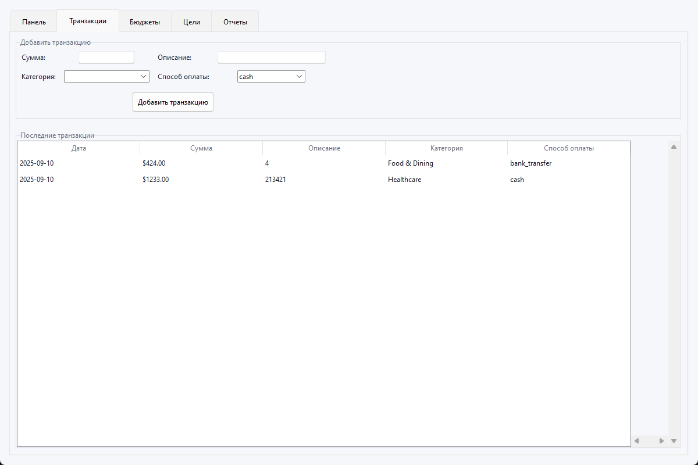

# Personal Finance Tracker

Русскоязычное настольное приложение на Python (Tkinter + SQLite + Matplotlib) для учёта доходов и расходов, бюджетов, целей и отчётов. Есть GUI и CLI режимы. Современное оформление интерфейса (`ttk` темы и стили), локализация на русский.

## Возможности
- Добавление транзакций с категориями, тегами и способом оплаты
- Сводка доходов/расходов и чистой стоимости
- Визуализации: пирог расходов по категориям и тренд 6 месяцев
- Бюджеты с порогами и предупреждениями
- Финансовые цели с прогрессом
- Экспорт/импорт CSV, экспорт JSON
- Инсайты и рекомендации

## Установка
Требуется Python 3.13+ (рекомендуется) и Git.

```bash
# Установка зависимостей
py -m pip install --user matplotlib pandas
```
`tkinter` входит в стандартную библиотеку Python для Windows.

## Запуск
```bash
# GUI-режим
py personalfinancetracker.py
# В меню выберите 2 (Графический интерфейс)

# CLI-режим
py personalfinancetracker.py
# В меню выберите 1 (Командная строка)
```
База данных создаётся автоматически в файле `finance_tracker.db`.

## Скриншоты
Добавьте свои изображения в `docs/screenshots/` и переименуйте их как указано ниже, либо скорректируйте пути.





## Структура
- `personalfinancetracker.py` — логика БД и GUI/CLI
- `finance_tracker.db` — SQLite база данных (создаётся при первом запуске)

## Сборка релиза (по желанию)
Можно использовать `pyinstaller` для сборки exe:
```bash
py -m pip install --user pyinstaller
py -m PyInstaller --noconfirm --onefile --windowed personalfinancetracker.py
```

## Лицензия
MIT
